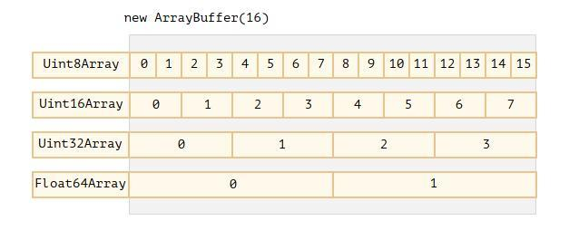

# ArrayBuffer, бинарные массивы.

## ArrayBuffer
В разработке с бинарными данными встречаются чаще всего тогда, когда требуется выполнить какие-то действия над файлами (создать, загрузить, скачать) или обработать изображение.

**Базовый объект для работы с бинарными данными имеет тип `ArrayBuffer` и представляет собой ссылку на непрерывную область памяти фиксированной длинны.**

```javascript
const buffer = new ArrayBuffer(16) // буфер длинной 16 байт
console.log(buffer.byteLength) // 16
```

Инструкция выше выделяет непрерывную область памяти размером 16 байт и заполняет её нулями.

`ArrayBuffer` - not array, его нельзя изменить:

```javascript
buffer.byteLength = 20

// 16 - изменение impossible
console.log(buffer.byteLength) 
```
`ArrayBuffer` - this is область памяти, в нём just лежит необработанный массив байтой.

**Для работы с `ArrayBuffer` нужен специальный объект, реализующий "представление" данных.**

Такие объекты not хранят какое-то собственное содержимое. They интерпретируют бинарные данные, хранящиеся в `ArrayBuffer`:

* `Uint8Array` – представляет каждый байт в `ArrayBuffer` как отдельное число; возможные значения находятся в промежутке от 0 до 255 (в байте 8 бит, отсюда такой набор). Такое значение называется «8-битное целое без знака».

* `Uint16Array` – представляет каждые 2 байта в `ArrayBuffer` как целое число; возможные значения находятся в промежутке от 0 до 65535. Такое значение называется «16-битное целое без знака».
* `Uint32Array` – представляет каждые 4 байта в `ArrayBuffer` как целое число; возможные значения находятся в промежутке от 0 до 4294967295. Такое значение называется «32-битное целое без знака».
* `Float64Array` – представляет каждые 8 байт в `ArrayBuffer` как число с плавающей точкой; возможные значения находятся в промежутке между 5.0x10-324 и 1.8x10308.

Таким образом, бинарные данные из `ArrayBuffer` размером 16 байт могут быть представлены how (как) 16 чисел маленькой разрядности или how 8 чисел большей разрядности (по 2 байта каждое), или how 4 числа ещё большей разрядности (по 4 байта каждое), или how 2 числа с плавающей точкой высокой точности (по 8 байт каждое).




`ArrayBuffer` – this is корневой объект, основа всего, необработанные бинарные данные.

But если нужно что-то записать в него или пройтись по его содержимому, да и вообще для любых действий нужно использовать какой-то объект-представление (`view`), например:

```javascript
let view = new Uint32Array(buffer)
console.log(Uint32Array.BYTES_PER_ELEMENT) // 4 байта на каждое целое число

console.log(view.length) // 4, именно столько чисел сейчас хранится в буфере
console.log(view.byteLength) // 16, размер содержимого в байтах

view[0] = 123456

for (let num of view) console.log(num) // 12345, затем 0 три раза
```
*** 

## TypedArray

Общий термин для all представлений `Uint8Array` и т.д. - this is `TypedArray`, типизированный массив. У них имеются набор одинаковых свойств и методов.

Конструкторы типизированных arrays (будь то `Int8Array` или `Float64Array` или любой другой) ведут себя по разному в зависимости от передаваемого им аргумента.

Есть 5 вариантов создания типизированных arrays:

```javascript
new TypedArray(buffer, [byteOffset], [length])
new TypedArray(object)
new TypedArray(typedArray)
new TypedArray()
```

1. If передан аргумент типа `ArrayBuffer`, то создаётся объект-представление для него (`view` из примера выше).
   * Дополнительно can (можно) указать аргументы `byteOffset` (0 default) и `length` (до конца буфера default), тогда представление будет покрывать только часть данных в `buffer`.
2. If в качестве аргумента передан `Array` или какой-то нибудь псевдомассив, то будет создан типизированный array такой же длинны и с тем же содержимым.
    * Can (можно) использовать эту возможность, чтобы заполнить типизированный массив начальными данными: 
  
    ```javascript
    let arr = new Uint8Array([0, 1, 2, 3])
    console.log(arr.length) // 4
    console.log(arr[1]) // 1, заполнен 4-мя байтами с указанными значениями
    ```
3. If в конструктор передан другой объект типа `TypedArray`, то делается то же самое: создаётся типизированный массив с такой же length и в него копируется содержимое. При необходимости значения будут приведены к новому типу.

    ```javascript
    let arr16 = new Uint16Array([1, 1000])
    let arr8 = new Uint8Array(arr16)

    console.log(arr8[0]) // 1
    console.log(arr8[1]) // 232, because 1000 not помещается в 8 бит
    ```
4. If передано число `length` - будет создан создан типизированный array, содержащий именно столько элементов. Размер нового array в байтах будет равен числу элементов length, умноженному на размер одного элемента `TypedArray.BYTES_PER_ELEMENT`:

    ```javascript
    let arr = new Uint16Array(4) // создаём типизированный array для 4 целых 16-битных чисел без знака
    console.log(Uint16Array.BYTES_PER_ELEMENT) // 2 байта на число
    console.log(arr.byteLength) // 8 (size array в байтах)
    ```

5. При вызове без аргументов будет создан пустой типизированный array.


Для доступа к `ArrayBuffer` есть следующие свойства:

* `arr.buffer` – ссылка на объект `ArrayBuffer`.
* `arr.byteLength` – размер содержимого `ArrayBuffer` в байтах.

Таким образом, можно перейти от одного представления к другому:

```javascript
let arr8 = new Uint8Array([0,1,2,3])

// другое представление на тех же данных
let arr16 = new Uint16Array(arr8.buffer) // [ 256, 770 ]
```

Список типизированных массивов:

* `Uint8Array`, `Uint16Array`, `Uint32Array` – целые беззнаковые числа по 8, 16 и 32 бита соответственно.
    * `Uint8ClampedArray` – 8-битные беззнаковые целые, обрезаются по верхней и нижней границе при присвоении (об этом ниже).
* `Int8Array`, `Int16Array`, `Int32Array` – целые числа со знаком (могут быть отрицательными).
* `Float32Array`, `Float64Array` – 32- и 64-битные числа со знаком и плавающей точкой.
***

## Выход за пределы допустимых значений

That, if попытаться записать в типизированный array значение, которое превышает допустимое для данного array? Ошибки не будет. Лишние биты просто будут отброшены.

If записать в объект `Uint8Array` число 256, то это число автоматически станет 0-м.

```javascript
let arr8 = new Uint8Array([256])
arr8 // [ 0 ]
```
***

## Методы TypedArray

Типизированные arrays `TypedArray` за несколькими заметными исключениями, имеют те же методы, что и обычные `Array`. 

Можно обходить их, вызывать `map`, `slice`, `find`, `reduce` и т.д.

Однако, есть некоторые вещи, которые нельзя осуществить:

* No метода `splice` - нельзя удалять значения, потому что типизированные массивы – это всего лишь представления данных из буфера, а буфер – это непрерывная область памяти фиксированной длины. Can (можно) только записать 0 вместо значения.
* No метода `concat`.

Зато есть два дополнительных метода: 

* `arr.set(fromArr, [offset]))` - копирует all элементы из `fromArr` в `arr`, начиная с позиции `offset` (0 default).
* `arr.subarray([begin, end])` - создаёт new представление того же типа для данных, начиная с позиции `begin` до `end` (не включая).

Эти методы позволяют копировать типизированные arrays, смешивать их, создавать новые на основе существующих и т.д.
***

## DataView

`DataView` - специальное супергибкое нетипизированное представление данных из `ArrayBuffer`. Оно позволяет обращаться к данным на любой позиции и в любом формате.

* В случае типизированных arrays конструктор строго задаёт формат данных. Весь array состоит из однотипных значений. Доступ к `i` элементу можно получить как `arr[i]`.
* В случае `DataView` доступ к данным осуществляется посредством методов типа `.getUint8(i)` или `.getUint16(i)`. Перебор формата данных происходит в момент обращения к ним, а не в момент создания.

```javascript
new DataView(buffer, [byteOffset], [byteLength])
```

* `buffer` - ссылка на бинарные данные `ArrayBuffer`. 
* `bytyOffset` - начальная позиция данных для представления (default 0).
* `byteLength` - length данных (в байтах) используемых в представлении (default - до конца `buffer`).

К примеру извлечение числа в разных форматах из одного и того же буфера двоичных данных: 

```javascript
// бинарный array состоит из 4-х байт, каждый имеет максимальное значение 255
let buffer = new Uint8Array([255,255,255,255]).buffer
let dataView = new DataView(buffer)


dataView.getInt8(0) // -1
dataView.getUint8(0) // 255
dataView.getUint16(0) // 65535
dataView.getUint32(0) // 4294967295
dataView.setUint32(0, 0) //  при установке 4-байтового числа в 0, во все его 4 байта будут записаны нули
```

**Представление `DataView` отлично подходит, когда нужно хранить данные разного формата в одном буфере.**

