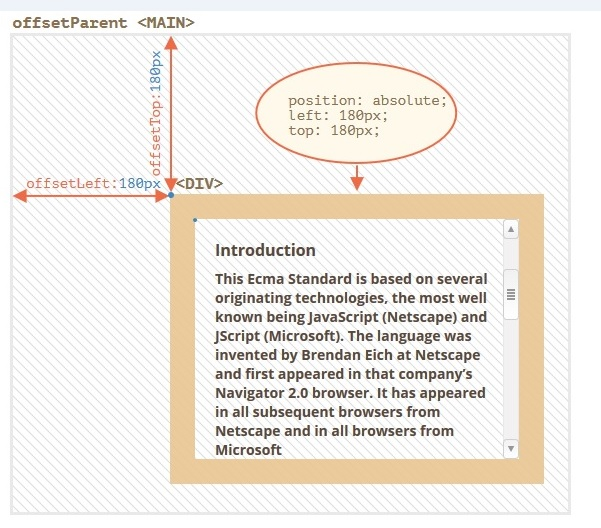
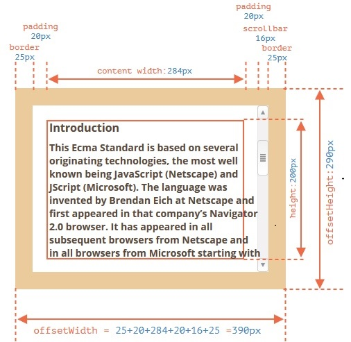
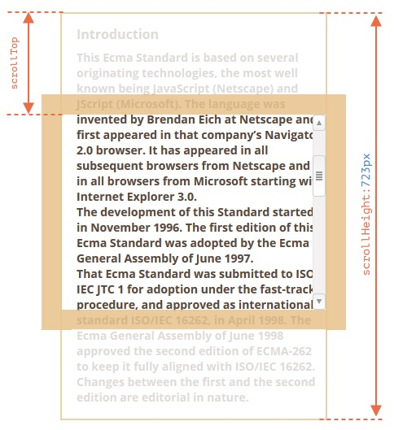
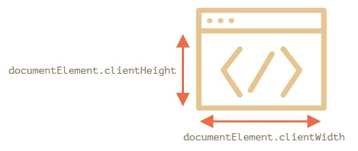
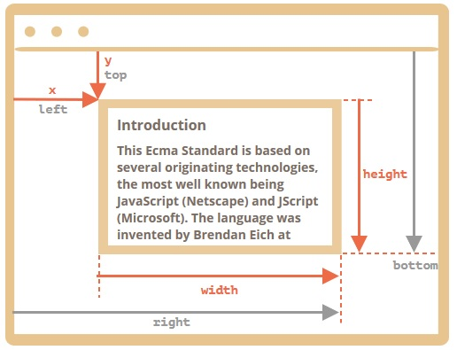

## offsetParent, offsetLeft/Top

В свойстве `offsetParent` находится предок элемента, который используется внутри браузера для вычисления координат при рендеринге (у каждого браузера он может быть свой).

То есть, ближайший предок, который удовлетворяет следующим условиям:

1. Является CSS-позиционированным (CSS-свойство `position` равно absolute, relative, fixed или sticky);
2. или `td`, `th`, `table`;
3. или `body`.

Свойства `offsetLeft/offsetTop` содержат координаты x/y относительно верхнего левого угла offsetParent.

Пример: 


***

## offsetWidth/Height

Эти два свойства – самые простые. Они содержат «внешнюю» ширину/высоту элемента, то есть его полный размер, включая рамки (полную ширину/высоту того, что нужно).

Пример: 


 
***

## clientWidth/Height

Эти свойства – размер области внутри рамок элемента.

Они включают в себя ширину области содержимого вместе с внутренними отступами padding, но без прокрутки:


Горизонтальной прокрутки нет, так что это в точности то, что внутри рамок: CSS-высота 200px плюс верхние и нижние внутренние отступы (2 * 20px), итого 240px.

Теперь `clientWidth` – ширина содержимого здесь равна не 300px, а 284px, т.к. 16px отведено для полосы прокрутки. Таким образом: 284px плюс левый и правый отступы – всего 324px.

Если нет внутренних отступов padding, то `clientWidth/Height` в точности равны размеру области содержимого внутри рамок и полосы прокрутки (если она есть).

Поэтому в тех случаях, когда мы точно знаем, что отступов нет, можно использовать `clientWidth/clientHeight` для получения размеров внутренней области содержимого.

***

## scrollWidth/Height

Эти свойства – как `clientWidth/clientHeight`, но также включают в себя прокрученную (которую не видно) часть элемента.

Эти свойства можно использовать, чтобы «распахнуть» элемент на всю ширину/высоту.

Таким кодом:

```javascript
// распахнуть элемент на всю высоту
element.style.height = `${element.scrollHeight}px`;
```
***

## scrollLeft/scrollTop

Свойства `scrollLeft/scrollTop` – ширина/высота невидимой, прокрученной в данный момент, части элемента слева и сверху.

Следующая иллюстрация показывает значения `scrollHeight` и `scrollTop` для блока с вертикальной прокруткой.



Другими словами, свойство `scrollTop` – это «сколько уже прокручено вверх».

Так же свойства `scrollLeft/scrollTop` можно изменять.

`elem.scrollTop += 10`  - сделает прокрутку на 10px вниз.

Установка значения `scrollTop` на 0 или Infinity прокрутит элемент в самый верх/низ.
***

## Ширина/высота окна

Чтобы получить ширину/высоту окна, можно взять свойства `clientWidth/clientHeight` из `document.documentElement`:



*** 

## Прокрутка: scrollTo, scrollBy, scrollIntoView

Обычные элементы можно прокручивать, изменяя `scrollTop/scrollLeft`.

Мы можем сделать то же самое для страницы в целом, используя `document.documentElement.scrollTop/Left` (кроме основанных на старом WebKit (Safari), где, как сказано выше, `document.body.scrollTop/Left`).

Есть и другие способы, в которых подобных несовместимостей нет: специальные методы `window.scrollBy(x,y)` и `window.scrollTo(pageX,pageY)`.

* Метод `scrollBy(x,y)` прокручивает страницу относительно её текущего положения. Например, `scrollBy(0,10) `прокручивает страницу на 10px вниз.

* Метод `scrollTo(pageX,pageY)` прокручивает страницу на абсолютные координаты (pageX,pageY). То есть, чтобы левый-верхний угол видимой части страницы имел данные координаты относительно левого верхнего угла документа. Это всё равно, что поставить `scrollLeft/scrollTop`. Для прокрутки в самое начало мы можем использовать `scrollTo(0,0)`.
***

## scrollIntoView

Вызов `elem.scrollIntoView(top)` прокручивает страницу, чтобы `elem` оказался вверху. У него есть один аргумент:

* если `top=true` (по умолчанию), то страница будет прокручена, чтобы `elem` появился в верхней части окна. Верхний край элемента совмещён с верхней частью окна;

* если` top=false`, то страница будет прокручена, чтобы `elem` появился внизу. Нижний край элемента будет совмещён с нижним краем окна.
***

## Запретить прокрутку

Чтобы запретить прокрутку страницы, достаточно установить `document.body.style.overflow = "hidden"`, разрешить прокрутку обратно - `documeny.body.style.overflow = ""`.

Аналогичным образом мы можем «заморозить» прокрутку для других элементов, а не только для `document.body`.

Недостатком этого способа является то, что сама полоса прокрутки исчезает и текст сдвинется на её ширину. 

Это выглядит немного странно, но это можно обойти, если сравнить `clientWidth` до и после остановки, и если `clientWidth` увеличится (значит полоса прокрутки исчезла), то добавить padding в `document.body` вместо полосы прокрутки, чтобы оставить ширину содержимого прежней.

***

## Координаты относительно окна: getBoundingClientRect

Метод `elem.getBoundingClientRect()` возвращает координаты в контексте окна для минимального по размеру прямоугольника, который заключает в себе элемент `elem`, в виде объекта встроенного класса DOMRect. 

<b>Другими словами показывает координаты относительно окна браузера.

Основные свойства объекта типа DOMRect:

* x/y – X/Y-координаты начала прямоугольника относительно окна,
* width/height – ширина/высота прямоугольника (могут быть отрицательными).

Дополнительные, «зависимые», свойства:

* top/bottom – Y-координата верхней/нижней границы прямоугольника,
* left/right – X-координата левой/правой границы прямоугольника.

Пример: 

